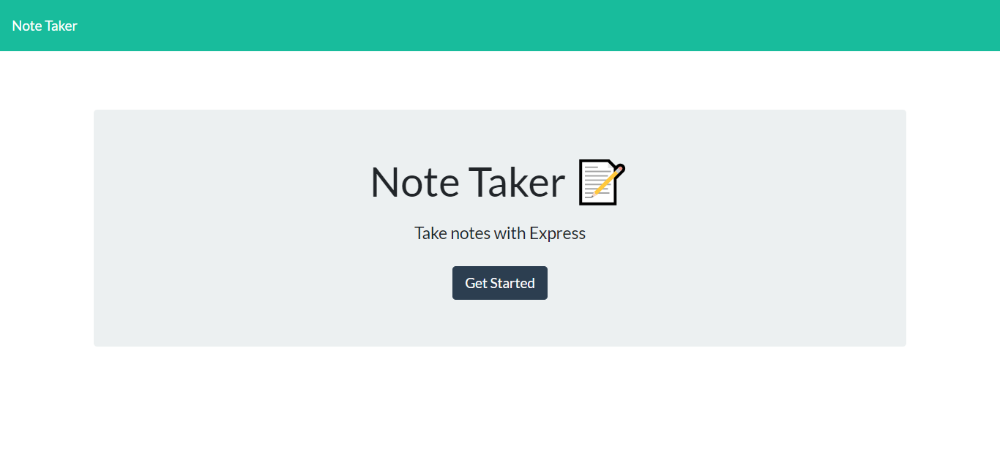
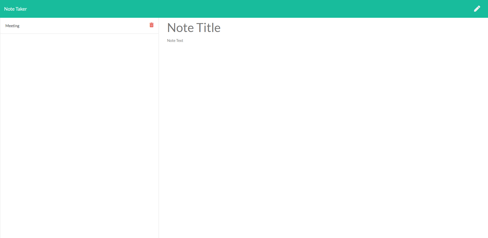
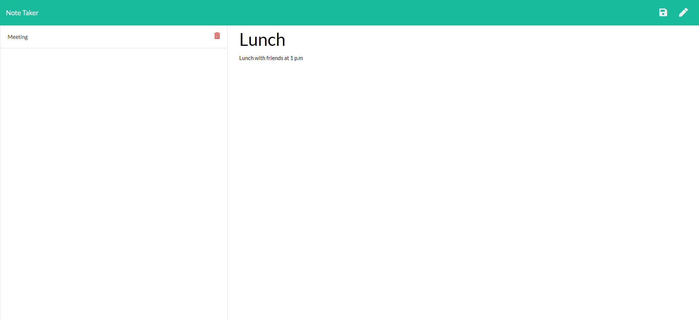
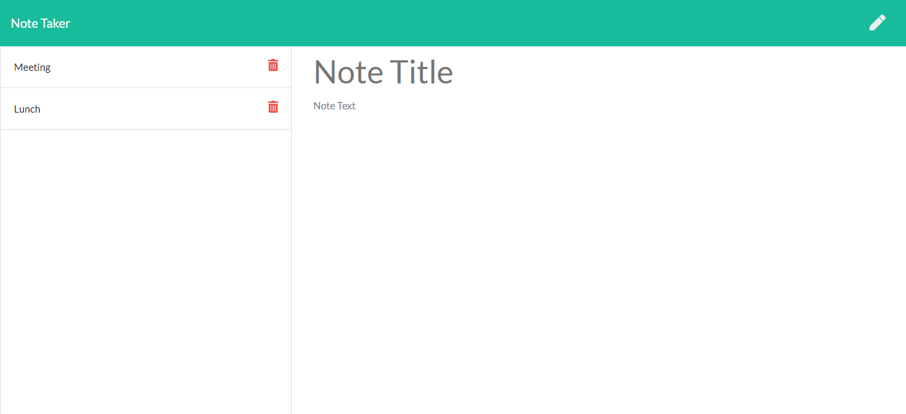
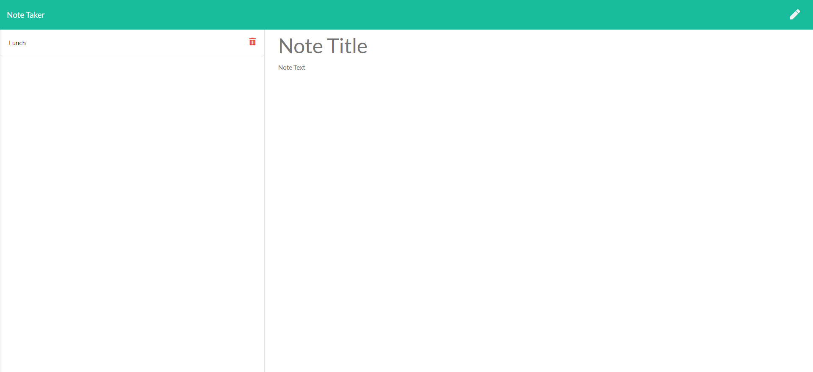

## Note Taker

Note taker is an application that uses an express backend to save, retrieve and delete notes from JSON file.

- The user starts at home page.
- On the home page, the user clicks the "Get Started" button to navigate to the notes page. This is shown in the screenshot below.

- On the left side of the screen is a list of existing notes,just showing the title of the note and a delete button ahead of it.

- Then user has to click on either the "Note Title" or "Note Text" field and then can type the text they want to be in the note.
- Once there is content in both fields, the save icon appears in the upper right next to the pencil icon.

- The user has to enter the details in those fields like meeting, lunch.
- When the user clicks on the save icon on the right, the note is added to the JSON file.
- The list of the notes on the left side is updated to include a new note.

- The user can review existing notes by clicking any of the note titles on the left.
- This will populate the "note title" and "note text" fields with the saved note information.

- A note can be deleted from the list by clicking the red trash can icon, by the note title in the list on the left.
- This will remove it from the file and update the list on the left side.

# Link to github page

https://github.com/Etipriya/note-taker

# Link to the deployed application

https://enigmatic-retreat-44951.herokuapp.com/
